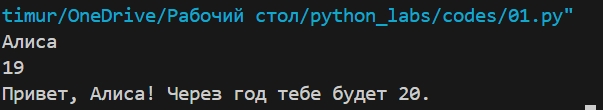

# Лабороторная работа №1

## задание 1
```python
name = str(input())
years = int(input())
print(f'Привет, {name}! Через год тебе будет {years+1}.')
```

## задание 2
```python 
a = float(input())
b = float(input())
sum = a + b
avg = sum / 2
print(f'sum={round(sum, 2)}; avg={round(avg, 2)}')
```

