# Лабороторная работа №1
## задание 1
```python
name = str(input())
years = int(input())
print(f'Привет, {name}! Через год тебе будет {years+1}.')
```

## задание 2
```python 
a = float(input())
b = float(input())
sum = a + b
avg = sum / 2
print(f'sum={round(sum, 2)}; avg={round(avg, 2)}')
```


## задание 3
```python
price, discount, vat = map(float, input().split())
base = price * (1 - discount / 100)
vat_amount = base * (vat / 100)
total = base + vat_amount
print(f'База после скидки:{base:.2f}₽')
print(f'НДС:{vat_amount:.2f}₽')
print(f'Итого к оплате:{total:.2f}₽')
```


## задание 4
```python
m = int(input())
print(f'{m // 60}:{m % 60}')
```

## задание 5
```python
fio = input().strip()
fio_cleaned = ' '.join(fio.split())
parts = fio_cleaned.split()
surname, name, patronymic = parts[0], parts[1], parts[2]
initials = surname[0] + name[0] + patronymic[0] + '.'
length = len(fio_cleaned)
print(f"Инициалы: {initials}")
print(f"Длина (символов): {length}")
```


# Лабороторная работа №2
## задание 1.1
```python
def min_max(nums):
    if not nums:
        raise ValueError
    
    return (min(nums), max(nums))
#тест кейсы
print(min_max([3, -1, 5, 5, 0]))
print(min_max([42]))
print(min_max([-5, -2, -9]))
print(min_max([1.5, 2, 2.0, -3.1]))
print(min_max([]))
```

## задание 1.2
```python
def unique_sorted(n):
    n = set(n)
    return sorted(n)
# тест кейсы
print(unique_sorted([3, 1, 2, 1, 3]))
print(unique_sorted([]))
print(unique_sorted([-1, -1, 0, 2, 2]))
print(unique_sorted([1.0, 1, 2.5, 2.5, 0]))
```


## задание 1.3
```python
def flatten(mat):
    res = []
    for i in mat:
        if not isinstance(i, (list, tuple)):
            raise TypeError
        res.extend(i)
    return res
# тест кейсы
print(flatten([[1, 2], [3, 4]]))
print(flatten([[1, 2], (3, 4, 5)]))
print(flatten([[1], [], [2, 3]]))
print(flatten([[1, 2], "ab"]))
```

## задание B.1
```python
def transpose(mat):
    if not mat:
        return []
    lenn = len(mat[0])
    for row in mat:
        if len(row) != lenn:
            raise ValueError
    res = []
    for colindex in range(len(mat[0])):
        newrow = []
        for rowindex in range(len(mat)):
            newrow.append(mat[rowindex][colindex])
        res.append(newrow)
    return res
#тест кейсы
print(transpose([[1, 2, 3]]))
print(transpose([[1], [2], [3]]))
print(transpose([[1, 2], [3, 4]]))
print(transpose([[]]))
print(transpose([[1, 2], [3]]))
```
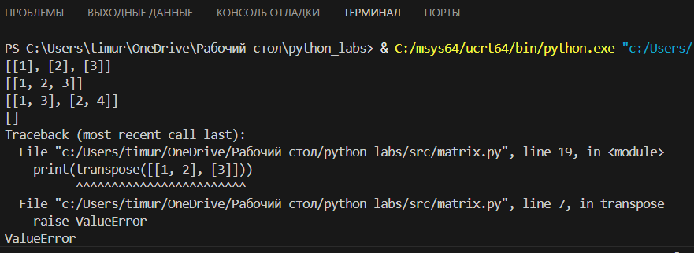

## задание B.2
```python
def row_sums(mat):
    if not mat:
        return []
    lenn1 = len(mat[0])
    for i, row in enumerate(mat):
        if len(row) != lenn1:
            raise ValueError
    return [int(sum(row)) for row in mat]
#тест кейсы
print(row_sums([[1, 2, 3], [4, 5, 6]]))
print(row_sums([[-1, 1], [10, -10]]))
print(row_sums([[0, 0], [0, 0]]))
print(row_sums([[1, 2], [3]]))
```
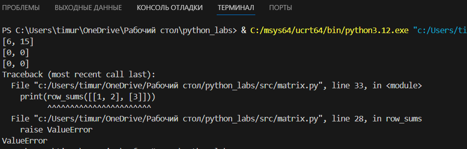

## задание B.3
```python
def col_sums(mat):
    if not mat:
        return []
    lenn1 = len(mat[0])
    for i, row in enumerate(mat):
        if len(row) != lenn1:
            raise ValueError
    numcols = len(mat[0])
    sums = [0] * numcols
    
    for row in mat:
        for j in range(numcols):
            sums[j] += row[j]
    return sums
#тест кейсы
print(col_sums([[1, 2, 3], [4, 5, 6]]))
print(col_sums([[-1, 1], [10, -10]]))
print(col_sums([[0, 0], [0, 0]]))
print(col_sums([[1, 2], [3]]))
```
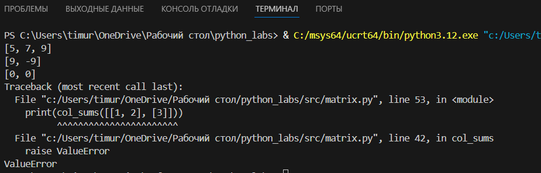
## задание C
```python
def format_record(rec):
    if not isinstance(rec, tuple) or len(rec) != 3:
        raise TypeError
    
    fio, group, gpa = rec
    
    if not isinstance(fio, str):
        raise TypeError
    if not isinstance(group, str):
        raise TypeError
    if not isinstance(gpa, (int, float)):
        raise TypeError
    
    fio_clean = ' '.join(fio.split()).strip()
    if not fio_clean:
        raise ValueError
    
    group_clean = group.strip()
    if not group_clean:
        raise ValueError
    
    if gpa < 0:
        raise ValueError
    
    parts = fio_clean.split()
    surname = parts[0].title()
    
    initials = []
    for name_part in parts[1:]:
        if name_part:
            initials.append(f"{name_part[0].upper()}.")
    
    formatted_fio = f"{surname} {''.join(initials)}"
    formatted_gpa = f"{gpa:.2f}"
    
    return f"{formatted_fio}, гр. {group_clean}, GPA {formatted_gpa}"
#тест кейсы
if __name__ == "__main__":
    test_cases = [
        ("Иванов Иван Иванович", "BIVT-25", 4.6),
        ("Петров Пётр", "IKBO-12", 5.0),
        ("Петров Пётр Петрович", "IKBO-12", 5.0),
        ("  сидорова  анна   сергеевна ", "ABB-01", 3.999),
    ]
    
    for test in test_cases:
        print(format_record(test))
```
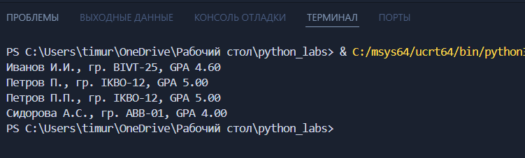

# Лабороторная работа №3
## задание A.1
```python
def normalize(text: str, *, casefold: bool = True, yo2e: bool = True) -> str:
    if yo2e:
        text = text.replace('ё', 'е').replace('Ё', 'Е')
    result = []
    for char in text:
        if char in {'\t', '\r', '\n', '\v', '\f'}:
            result.append(' ')
        else:
            result.append(char)
    text = ''.join(result)
    if casefold:
        text = text.casefold()
    words = text.split()
    return ' '.join(words)
#тест кейсы
print(repr(normalize("ПрИвЕт\nМИр\t")))  
print(repr(normalize("ёжик, Ёлка")))
print(repr(normalize("Hello\r\nWorld")))
print(repr(normalize("  двойные   пробелы  ")))
```
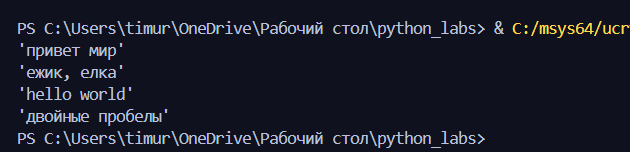
## задание A.2
```python
def tokenize(text):
    tokens = []
    current_token = []
    for ch in text:
        if ch.isalnum() or ch == '_':
            current_token.append(ch)
        elif ch == '-' and current_token:
            current_token.append(ch)
        else:
            if current_token:
                tokens.append(''.join(current_token))
                current_token = []
    if current_token:
        tokens.append(''.join(current_token))
    
    return tokens
# тест кейсы
print(tokenize("привет мир"))
print(tokenize("hello,world!!!"))
print(tokenize("по-настоящему круто"))
print(tokenize("emoji 😀 не слово"))
```
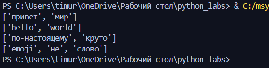
## задание A.3
```python
def count_freq(tokens):
    freq_dict = {}
    for token in tokens:
        freq_dict[token] = freq_dict.get(token, 0) + 1
    return freq_dict
#тест кейсы
print(count_freq(["a","b","a","c","b","a"]))
print(count_freq(["bb","aa","bb","aa","cc"]))
```
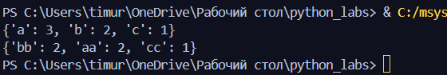
## задание A.4
```python
def top_n(freq, n):
    sorted_items = sorted(freq.items(), key=lambda x: (-x[1], x[0]))
    return sorted_items[:n]
#тест кейсы
print(top_n({"a": 3, "b": 2, "c": 1},n=2))
print(top_n({"bb": 2, "aa": 2, "cc": 1}, n=2))
```
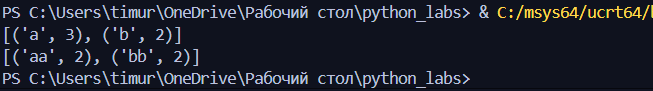
## задание B
```python
from lib.text import normalize, tokenize, count_freq, top_n
import sys
def main():
    text = sys.stdin.buffer.read().decode('utf-8') #вход к бинарным данным,преобразует строку в юникод
    if not text.strip():
        print("Нет входных данных")
        return
    normalized_text = normalize(text)
    tokens = tokenize(normalized_text)
    

    if not tokens:
        print("В тексте не найдено слов")
        return

    total_words = len(tokens)
    freq_dict = count_freq(tokens)
    unique_words = len(freq_dict)
    top_words = top_n(freq_dict, 5)
    
    print(f"Всего слов: {total_words}")
    print(f"Уникальных слов: {unique_words}")
    print("Топ-5:")
    for word, count in top_words:
        print(f"{word}: {count}")


if __name__ == "__main__":  
    main()
```
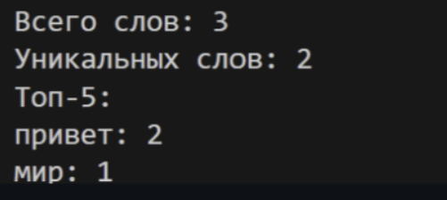

# Лабороторная работа №4

## задание А
```python
from pathlib import Path
import csv

def read_text(path, encoding ='utf-8'):
    path = Path(path) #класс предоставляет не только путь к файлу, но и возможность работы с ним
    with open(path, 'r', encoding=encoding) as f:
        return f.read()

try:
    text = read_text('src/data/input.txt', encoding='utf-8')
    print(text)
except FileNotFoundError:
    print('Файл не найден')
except UnicodeDecodeError:
    print('Неподходящая кодировка')


def write_csv(rows, path, header):
    path = Path(path)
    if rows:
        last_len = len(rows[-1])
        for row in rows:
            if len(row) != last_len:
                raise ValueError
    with open(path, 'w', newline = '', encoding = 'utf-8') as f:
        csv_maker = csv.writer(f, delimiter=',')
        if header:
            csv_maker.writerow(header)
        for row in rows:
            csv_maker.writerow(row)

write_csv([("word","count"),("test",3)], "src/data/check.csv", None)  # создаст CSV
```
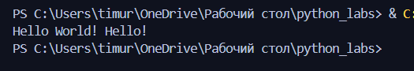

## задание B

```python
from pathlib import Path
import csv

import sys
sys.path.append(r'C:\Users\user\Desktop\python_labs\src')
from lib.text import *


def read_text(path, encoding = 'utf-8'):
    path = Path(path)
    with open(path, 'r', encoding = 'utf-8') as f:
        return f.read()

def report_writer(path, count_f, encoding = 'utf-8'):
    path = Path(path)
    sortirovka = top_n(count_f, len(count_f))
    with open(path, 'w', newline = '', encoding='utf-8') as f:
        csv_maker = csv.writer(f, delimiter=',')
        csv_maker.writerow(('word', 'count'))
        for word, freq in sortirovka:
            csv_maker.writerow((word, freq))

try:
    text_i = read_text('src/data/input.txt', encoding='utf-8')
    norm = normalize(text_i)
    token = tokenize(norm)
    count_f = count_freq(token) 
    top = top_n(count_f, 5)

    report_writer('src/data/report.csv',count_f, encoding = 'utf-8')
    print('Всего слов:', len(token))
    print('Уникальных слов:', len(count_f))
    for t in top:
        print(t[0], ':', t[1])
except FileNotFoundError:
    print('Файл не найден')
except UnicodeDecodeError:
    print('Неподходящая кодировка')
```
p.s пришлось переместить lib в src/lab04

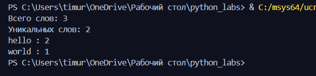

# Лабороторная работа №5

## задание A
```python
import json
import csv
from pathlib import Path


def json_to_csv(json_path: str, csv_path: str) -> None:
    # Проверка расширения файла
    if not json_path.lower().endswith('.json'):
        raise ValueError("Исходный файл должен быть в формате JSON")
    if not csv_path.lower().endswith('.csv'):
        raise ValueError("Целевой файл должен быть в формате CSV")
    
    # Проверка существования файла
    json_file = Path(json_path)
    if not json_file.exists():
        raise FileNotFoundError(f"Файл {json_path} не найден")
    
    # Чтение JSON
    try:
        with open(json_path, 'r', encoding='utf-8') as f:
            data = json.load(f)
    except json.JSONDecodeError as e:
        raise ValueError(f"Ошибка парсинга JSON: {e}")
    
    # Проверка типа данных
    if not isinstance(data, list):
        raise ValueError("JSON должен содержать список объектов")
    
    if len(data) == 0:
        raise ValueError("JSON файл пуст")
    
    # Получение всех уникальных полей (из первого объекта + алфавитная сортировка остальных)
    if len(data) > 0:
        first_item_fields = list(data[0].keys()) if data[0] else []
        all_fields = set(first_item_fields)
        
        for item in data[1:]:
            if isinstance(item, dict):
                all_fields.update(item.keys())
        
        # Порядок: сначала поля из первого объекта, затем остальные в алфавитном порядке
        remaining_fields = sorted(all_fields - set(first_item_fields))
        fieldnames = first_item_fields + remaining_fields
    else:
        fieldnames = []
    
    # Запись CSV
    try:
        with open(csv_path, 'w', encoding='utf-8', newline='') as f:
            if fieldnames:
                writer = csv.DictWriter(f, fieldnames=fieldnames)
                writer.writeheader()
                
                for item in data:
                    if not isinstance(item, dict):
                        raise ValueError("Все элементы JSON должны быть словарями")
                    
                    # Заполняем отсутствующие поля пустыми строками
                    row = {field: item.get(field, '') for field in fieldnames}
                    # Конвертируем не-строковые значения в строки
                    row = {k: str(v) if not isinstance(v, str) else v for k, v in row.items()}
                    writer.writerow(row)
    except Exception as e:
        raise ValueError(f"Ошибка записи CSV: {e}")


def csv_to_json(csv_path: str, json_path: str):
    #ошибки в форматах
    if not csv_path.lower().endswith('.csv'):
        raise ValueError("Исходный файл должен быть в формате CSV")
    if not json_path.lower().endswith('.json'):
        raise ValueError("Целевой файл должен быть в формате JSON")
    
    # Проверка существования файла
    csv_file = Path(csv_path)
    if not csv_file.exists():
        raise FileNotFoundError(f"Файл {csv_path} не найден")
    try:
        with open(csv_path, 'r', encoding='utf-8') as f:
            reader = csv.DictReader(f)
            # Проверка наличия заголовков
            if reader.fieldnames is None:
                raise ValueError("CSV файл должен содержать заголовок")
            data = list(reader)
            
    except Exception as e:
        raise ValueError(f"Ошибка чтения CSV: {e}")
    if len(data) == 0:
        raise ValueError("CSV файл пуст (нет данных, только заголовок)")
    
    # Запись JSON
    try:
        with open(json_path, 'w', encoding='utf-8') as f:
            json.dump(data, f, ensure_ascii=False, indent=2)
    except Exception as e:
        raise ValueError(f"Ошибка записи JSON: {e}")


# Примеры использования (для тестирования)
if __name__ == "__main__":
    try:
        # Тест JSON -> CSV
        test_json = [
            {"name": "Alice", "age": 25, "country": "Russia", "city": "Moscow"},
            {"name": "Bob", "age": 30, "country": "USA", "city": "New York"},
            {"name": "Charlie", "age": 14, "country": "United Kingdom", "city": "London"}
        ]
        
        with open('src/data/samples/people.json', 'w', encoding='utf-8') as f:
            json.dump(test_json, f, ensure_ascii=False, indent=2)
        
        json_to_csv('src/data/samples/people.json', 'src/data/out/people_from_json.csv')
        print("JSON -> CSV: успешно")

        csv_to_json('src/data/samples/people.csv', 'src/data/out/people_from_csv.json')
        print("CSV -> JSON: успешно")
        
    except Exception as e:
        print(f"Ошибка: {e}")
```
## JSON -> CSV
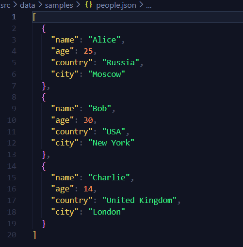
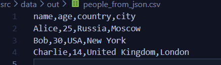

## CSV -> JSON
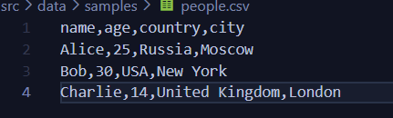


## вывод терминала
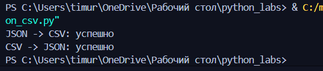

## задание B (CSV -> XLSX)
```python
import csv
from openpyxl import Workbook 
from openpyxl.utils import get_column_letter 
from pathlib import Path
import sys
sys.path.append(r"C:\Users\user\Desktop\python_labs\src")
def csv_to_xlsx(csv_path_1, xlsx_path_2):
    csv_newpath = Path(csv_path_1)
    xlsx_newpath = Path(xlsx_path_2)

    if not csv_newpath.exists():
        raise FileNotFoundError("Файла csv не существует")

    workbook = Workbook()  # создание книги эксель
    work_sheet = workbook.active  # активный лист
    work_sheet.title = "Sheet1"

    column_width = {}  # для макс ширины столбца

    with csv_newpath.open("r", encoding="utf-8") as cf:
        csv_reading = csv.reader(cf)
        for row in csv_reading:
            work_sheet.append(row)
            for column_ind, value in enumerate(row, start=1):  # enumerate для получения (индекс, значение)
                cell_length = len(value)  # длина значения
                if cell_length > column_width.get(column_ind, 0):  # случай, если длина значения > текущей макс ширины
                    column_width[column_ind] = cell_length

    for column_ind, width in column_width.items():  # для индекса, ширины в словаре
        letter = get_column_letter(column_ind)  # исходя из индекса, присваеваем столбцам экселевские буквы
        work_sheet.column_dimensions[letter].width = ((width + 2) if (width + 2) >= 8 else 8)  # по 1 отступу с обеих сторон

    workbook.save(xlsx_newpath)


if __name__ == "__main__":  # запуск напрямую
    csv_path = "src/data/samples/people.csv"
    xlsx_path = "src/data/out/res_people.xlsx"
    csv_to_xlsx(csv_path, xlsx_path)

```
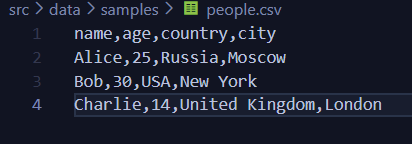
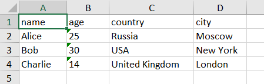
