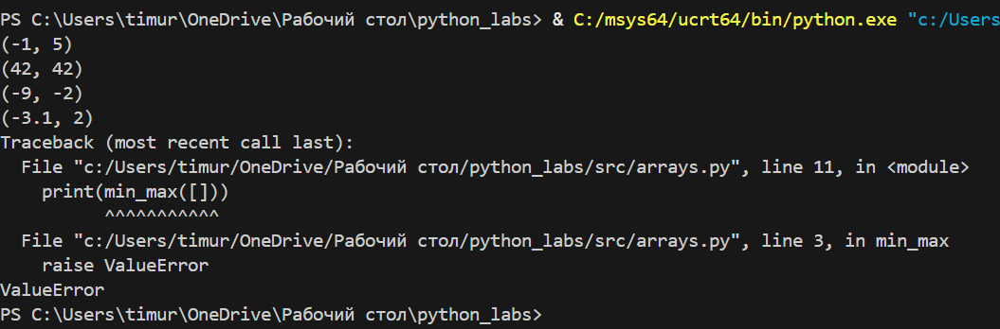

# Лабороторная работа №1
## задание 1
```python
name = str(input())
years = int(input())
print(f'Привет, {name}! Через год тебе будет {years+1}.')
```

## задание 2
```python 
a = float(input())
b = float(input())
sum = a + b
avg = sum / 2
print(f'sum={round(sum, 2)}; avg={round(avg, 2)}')
```


## задание 3
```python
price, discount, vat = map(float, input().split())
base = price * (1 - discount / 100)
vat_amount = base * (vat / 100)
total = base + vat_amount
print(f'База после скидки:{base:.2f}₽')
print(f'НДС:{vat_amount:.2f}₽')
print(f'Итого к оплате:{total:.2f}₽')
```


## задание 4
```python
m = int(input())
print(f'{m // 60}:{m % 60}')
```

## задание 5
```python
fio = input().strip()
fio_cleaned = ' '.join(fio.split())
parts = fio_cleaned.split()
surname, name, patronymic = parts[0], parts[1], parts[2]
initials = surname[0] + name[0] + patronymic[0] + '.'
length = len(fio_cleaned)
print(f"Инициалы: {initials}")
print(f"Длина (символов): {length}")
```


# Лабороторная работа №2
## задание 1.1
```python
def min_max(nums):
    if not nums:
        raise ValueError
    
    return (min(nums), max(nums))
#тест кейсы
print(min_max([3, -1, 5, 5, 0]))
print(min_max([42]))
print(min_max([-5, -2, -9]))
print(min_max([1.5, 2, 2.0, -3.1]))
print(min_max([]))
```

## задание 1.2
```python
def unique_sorted(n):
    n = set(n)
    return sorted(n)
# тест кейсы
print(unique_sorted([3, 1, 2, 1, 3]))
print(unique_sorted([]))
print(unique_sorted([-1, -1, 0, 2, 2]))
print(unique_sorted([1.0, 1, 2.5, 2.5, 0]))
```


## задание 1.3
```pyhton
def flatten(mat):
    res = []
    for i in mat:
        if not isinstance(i, (list, tuple)):
            raise TypeError
        res.extend(i)
    return res
print(flatten([[1, 2], [3, 4]]))
print(flatten([[1, 2], (3, 4, 5)]))
print(flatten([[1], [], [2, 3]]))
print(flatten([[1, 2], "ab"]))
```

## задание B.1
```python
def transpose(mat):
    if not mat:
        return []
    lenn = len(mat[0])
    for row in mat:
        if len(row) != lenn:
            raise ValueError
    res = []
    for colindex in range(len(mat[0])):
        newrow = []
        for rowindex in range(len(mat)):
            newrow.append(mat[rowindex][colindex])
        res.append(newrow)
    return res
print(transpose([[1, 2, 3]]))
print(transpose([[1], [2], [3]]))
print(transpose([[1, 2], [3, 4]]))
print(transpose([[]]))
print(transpose([[1, 2], [3]]))
```


## задание B.2
```python
def row_sums(mat):
    if not mat:
        return []
    lenn1 = len(mat[0])
    for i, row in enumerate(mat):
        if len(row) != lenn1:
            raise ValueError
    return [int(sum(row)) for row in mat]
print(row_sums([[1, 2, 3], [4, 5, 6]]))
print(row_sums([[-1, 1], [10, -10]]))
print(row_sums([[0, 0], [0, 0]]))
print(row_sums([[1, 2], [3]]))
```


## задание B.3
```python
def col_sums(mat):
    if not mat:
        return []
    lenn1 = len(mat[0])
    for i, row in enumerate(mat):
        if len(row) != lenn1:
            raise ValueError
    numcols = len(mat[0])
    sums = [0] * numcols
    
    for row in mat:
        for j in range(numcols):
            sums[j] += row[j]
    return sums
print(col_sums([[1, 2, 3], [4, 5, 6]]))
print(col_sums([[-1, 1], [10, -10]]))
print(col_sums([[0, 0], [0, 0]]))
print(col_sums([[1, 2], [3]]))
```
