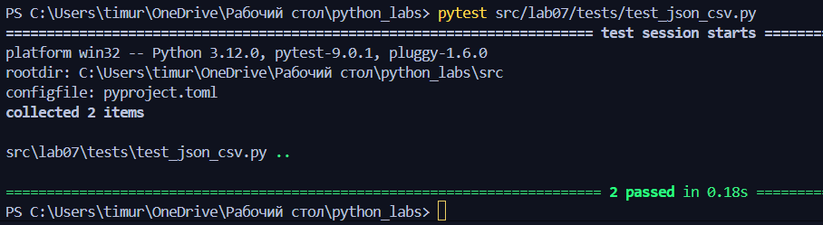

# тест для text.py
```python
import pytest
from lib.text import normalize, tokenize, count_freq, top_n


@pytest.mark.parametrize(  # подготовка параметров
    "source, expected",
    [
        ("ПрИвЕт\nМИр\t", "привет мир"),
        ("ёжик, Ёлка", "ежик, елка"),
        ("Hello\r\nWorld", "hello world"),
        ("  двойные   пробелы  ", "двойные пробелы"),
        ("", ""),  # пустые строки
        ("  ", ""),  # пустые строки с пробелами
    ],
)
def test_normalize(source, expected):
    assert normalize(source) == expected  # проверка


@pytest.mark.parametrize(
    "source, expected",
    [
        ("привет мир", ["привет", "мир"]),
        ("hello,world!!!", ["hello", "world"]),
        ("по-настоящему круто", ["по-настоящему", "круто"]),
        ("2025 год", ["2025", "год"]),
        ("emoji 😀 не слово", ["emoji", "не", "слово"]),
        ("", []),  # пустые строки
        ("!@#$%^&*()", []),  # спецсимволы
        ("  ", []),  # пустая строка с пробелами
    ],
)
def test_tokenize(source, expected):
    assert tokenize(source) == expected


@pytest.mark.parametrize(
    "source, expected",
    [
        (["a", "b", "a", "c", "b", "a"], {"a": 3, "b": 2, "c": 1}),
        (["bb", "aa", "bb", "aa", "cc"], {"aa": 2, "bb": 2, "cc": 1}),
        ([], {}),  # пустые списки
    ],
)
def test_count_freq(source, expected):
    assert count_freq(source) == expected


@pytest.mark.parametrize(
    "source, n, expected",
    [
        ({"a": 3, "b": 2, "c": 1}, 2, [("a", 3), ("b", 2)]),
        ({"aa": 2, "bb": 2, "cc": 1}, 2, [("aa", 2), ("bb", 2)]),
        ({}, 5, []),  # пустые словари
    ],
)
def test_top_n(source, n, expected):
    assert top_n(source, n) == expected
```


# тест для json_csv

План выполнения:

1.Используя pytest.mark.parametrize (параметризацию) прописываем то, что мы будем использовать для теста функций
2.После пишем функцию, которую хотим протестировать, чтобы она "прогнала" тесты

# тест для json_csv

```python
import pytest

import json
import csv
from lib_4json_csv.json_csv4lib import json_to_csv, csv_to_json


@pytest.fixture  # создаем тест-файл при помощи фикстуры
def sample_json(tmp_path):
    json_newfile = tmp_path / "people.json"  # создаем тест-файл
    text = [
        {"name": "Alice", "age": 25, "city": "Moscow"},
        {"name": "Bob", "age": 30, "city": "Saint Petersburg"},
        {"name": "Marie", "age": 28, "city": "Novosibirsk"},
    ]
    with open(json_newfile, "w", encoding="utf-8") as jf:
        json.dump(text, jf, ensure_ascii=False)
    return json_newfile  # возвращаем путь к созданному тест-файлу


@pytest.fixture
def sample_csv(tmp_path):
    csv_newfile = tmp_path / "people.csv"
    text = [
        ["name", "age", "city"],
        ["Alice", "25", "Moscow"],
        ["Bob", "30", "Saint Petersburg"],
        ["Marie", "28", "Novosibirsk"],
    ]
    with open(csv_newfile, "w", encoding="utf-8", newline="") as cf:
        csv_writer = csv.writer(cf)
        csv_writer.writerows(text)
    return csv_newfile


def test_json_to_csv(sample_json, tmp_path):
    csv_file = tmp_path / "people_from_jf.csv"

    json_to_csv(str(sample_json), str(csv_file))  # JSON -> CSV
    assert csv_file.exists()  # существует ли файл

    with open(csv_file, "r", encoding="utf-8") as cf:
        csv_reader = csv.DictReader(cf)
        rows = list(csv_reader)

        assert len(rows) == 3  # проверка данных
        assert rows[0]["name"] == "Alice"
        assert rows[0]["age"] == "25"
        assert rows[0]["city"] == "Moscow"


def test_csv_to_json(sample_csv, tmp_path):
    json_file = tmp_path / "people_from_cf.json"

    csv_to_json(str(sample_csv), str(json_file))
    assert json_file.exists()

    with open(json_file, "r", encoding="utf-8") as jf:
        json_reader = json.load(jf)

        assert len(json_reader) == 3
        assert json_reader[0]["name"] == "Alice"
        assert json_reader[0]["age"] == "25"
        assert json_reader[0]["city"] == "Moscow"
```
