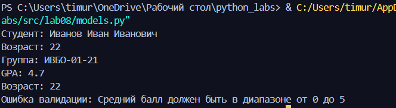
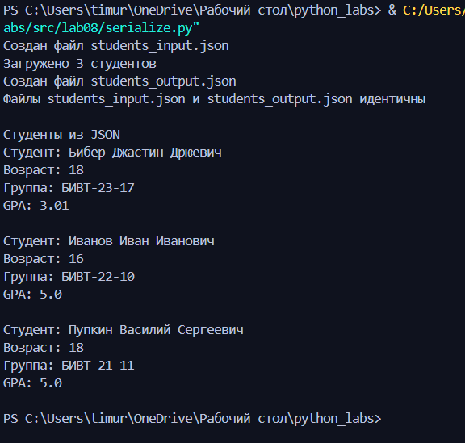
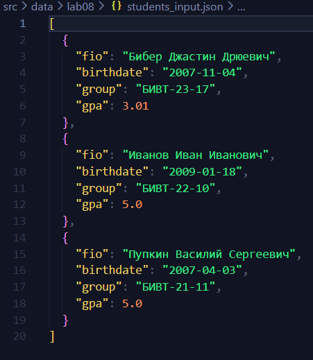

# models.py
Описание структуры класса Student:
Атрибуты:
fio - ФИО студента
birthdate - Дата рождения в формате YYYY-MM-DD(год-месяц-число)
group - название группы
gpa - средний балл(от 0 до 5)

Методы:
__post_init__(self)
Автоматически вызывается после инициализации объекта и ыполняет валидацию полей birthdate и gpa.

age(self)
Вычисляет текущий возраст студента в полных годах.

to_dict(self)
Преобразует объект в словарь с ключами: fio, birthdate, group, gpa.

@classmethod from_dict(cls, data: Dict[str, Any]) -> 'Student'
Создает объект Student из словаря 

__str__(self)
Возвращает строковое представление объекта

```python
from dataclasses import dataclass, field
from datetime import date, datetime
from typing import Dict, Any


def _validate_birthdate(value: str) -> str:
    """Валидация формата даты рождения YYYY-MM-DD"""
    try:
        datetime.strptime(value, "%Y-%m-%d")
    except ValueError:
        raise ValueError("Дата рождения должна быть в формате YYYY-MM-DD")
    return value


def _validate_gpa(value: float) -> float:
    """Валидация среднего балла: 0 ≤ gpa ≤ 5"""
    if not (0 <= value <= 5):
        raise ValueError("Средний балл должен быть в диапазоне от 0 до 5")
    return value


@dataclass
class Student:
    fio: str
    birthdate: str
    group: str
    gpa: float

    def __post_init__(self) -> None:
        # Выполняем валидацию после инициализации датакласса
        _validate_birthdate(self.birthdate)
        _validate_gpa(self.gpa)

    def age(self) -> int:
        """Возвращает текущий возраст студента в годах"""
        today = date.today()
        birth_date = datetime.strptime(self.birthdate, "%Y-%m-%d").date()
        age = today.year - birth_date.year
        # Уменьшаем на 1, если день рождения ещё не наступил в этом году
        if (today.month, today.day) < (birth_date.month, birth_date.day):
            age -= 1
        return age

    def to_dict(self) -> Dict[str, Any]:
        """Преобразует объект Student в словарь"""
        return {
            "fio": self.fio,
            "birthdate": self.birthdate,
            "group": self.group,
            "gpa": self.gpa
        }

    @classmethod
    def from_dict(cls, data: Dict[str, Any]) -> 'Student':
        """Создаёт экземпляр Student из словаря"""
        return cls(
            fio=data["fio"],
            birthdate=data["birthdate"],
            group=data["group"],
            gpa=data["gpa"]
        )

    def __str__(self) -> str:
        return  f"Студент: {self.fio}\nВозраст: {self.age()}\nГруппа: {self.group}\nGPA: {self.gpa}"


# Пример использования 
if __name__== "__main__":
    try:
        s1 = Student("Иванов Иван Иванович", "2003-05-15", "ИВБО-01-21", 4.7)
        print(s1)
        print("Возраст:", s1.age())
        s2 = Student("Сидоров Олег Викторович", "1999-11-01", "ИВБО-02-20", 7.0) # Ошибка
    except ValueError as e:
        print("Ошибка валидации:", e)
```


# serialize.py
```python
import json
from pathlib import Path

from models import Student


def students_to_json(students: list[Student], path: str | Path) -> None:
    path = Path(path)

    data = [s.to_dict() for s in students]

    with open(path, "w", encoding="utf-8") as f:
        json.dump(data, f, ensure_ascii=False, indent=2)


def students_from_json(path: str | Path) -> list[Student]:
    path = Path(path)

    with open(path, "r", encoding="utf-8") as f:
        raw = json.load(f)

    if not isinstance(raw, list):
        raise ValueError("JSON must contain array of students")

    students = []
    for obj in raw:
        try:
            student = Student.from_dict(obj)
            students.append(student)
        except Exception as e:
            raise ValueError(f"invalid student object: {obj!r}, error: {e}") from e

    return students

## Пример использования
def main():
    # 1. Сначала запишем входные данные в файл (если его еще нет)
    students = [
        Student(
            fio="Бибер Джастин Дрюевич",
            birthdate="2007-11-04",
            group="БИВТ-23-17",
            gpa=3.01,
        ),
        Student(
            fio="Иванов Иван Иванович",
            birthdate="2009-01-18",
            group="БИВТ-22-10",
            gpa=5.0,
        ),
        Student(
            fio="Пупкин Василий Сергеевич",
            birthdate="2007-04-03",
            group="БИВТ-21-11",
            gpa=5.0,
        ),
    ]
    
    # Создаем входной файл
    students_to_json(students, "src/data/lab08/students_input.json")
    print("Создан файл students_input.json")
    
    # 2. Читаем данные из входного файла
    loaded_students = students_from_json("src/data/lab08/students_input.json")
    print(f"Загружено {len(loaded_students)} студентов")
    
    # 3. Записываем результат в выходной файл
    students_to_json(loaded_students, "src/data/lab08/students_output.json")
    print("Создан файл students_output.json")
    
    # Проверяем, что файлы идентичны
    with open("src/data/lab08/students_input.json", "r", encoding="utf-8") as f1, \
         open("src/data/lab08/students_output.json", "r", encoding="utf-8") as f2:
        content1 = f1.read()
        content2 = f2.read()
        
    if content1 == content2:
        print("Файлы students_input.json и students_output.json идентичны")
    else:
        print("Файлы различаются")
    print("\nСтуденты из JSON")
    for s in loaded_students:
        print(s)
        print()


if __name__ == "__main__":
    main()
```


