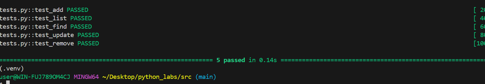

# Лабароторная работа 9
## group.py
```python
import csv
from pathlib import Path
from lab08.models import Student

class Group:
    def __init__(self, storage_path: str):
        self.path = Path(storage_path) #срока -> обьект Path
        if not self.path.exists(): #если файла не существует, создаем его
            self._ensure_storage_exists()

    def _ensure_storage_exists(self): #создание файла с заголовком, если его еще нет
        with open(self.path, 'w', newline='', encoding='utf-8') as cf:
            creator = csv.DictWriter(cf, fieldnames=['fio', 'birthdate', 'group', 'gpa'])
            creator.writeheader()

    def _read_all(self): #чтение информации с файла, список словарей
        list_students = []

        if self.path.exists():
            with open(self.path, 'r', encoding='utf-8') as cf:
                file_reader = csv.DictReader(cf)

                if file_reader.fieldnames != ['fio', 'birthdate', 'group', 'gpa']:
                    raise ValueError('Заголовки не совпадают с ожидаемыми')

                for row in file_reader:
                    list_students.append(row)
            return list_students

    def _write_all(self, students: list[dict]): #запись студентов
        with open(self.path, 'w', encoding='utf-8', newline='') as cf:
            file_writer = csv.DictWriter(cf, fieldnames=['fio', 'birthdate', 'group', 'gpa'])
            file_writer.writeheader()
            file_writer.writerows(students)

    def list(self): #возвращаем список студентов (Student)
        data = self._read_all()
        list_students = []

        for students in data:
            try:
                student = Student(
                    fio = students['fio'],
                    birthdate = students['birthdate'],
                    group = students['group'],
                    gpa = float(students['gpa'])
                )
                list_students.append(student)
            except ValueError as e:
                print('Данные некоректны')
        return list_students

    def add(self, student: Student): # новый студент в Student
        data = {
            'fio': student.fio,
            'birthdate': student.birthdate,
            'group': student.group,
            'gpa': str(student.gpa)
        }

        with open(self.path, 'a', encoding='utf-8', newline='') as cf: # добавляем нового студента через append
            file_writer = csv.DictWriter(cf, fieldnames=['fio', 'birthdate', 'group', 'gpa'])
            file_writer.writerow(data)

    def find(self, substr: str): # находим студента по фамилии
        data = self._read_all()
        found_student = [r for r in data if substr.lower() in r['fio'].lower()] # независимый от регистра поиск (все в нижнем регистре)
        found_inf = []
        for student_dict in found_student:
            try:
                student = Student(
                    fio=student_dict["fio"],
                    birthdate=student_dict["birthdate"],
                    group=student_dict["group"],
                    gpa=float(student_dict["gpa"]),
                )
                found_inf.append(student)
            except ValueError as e:
                print('Данные неверны')
        return found_inf #возвращаем список

    def remove(self, fio:str): # удаляем запись по фамилии
        dict_students = self._read_all() #список словарей
        i = len(dict_students) - 1
        flag_of_removing = False # удалили - НЕТ

        while i >= 0:
            if dict_students[i]['fio'] == fio: #проходимся по обьектам списка с конца
                dict_students.pop(i)
                flag_of_removing = True # удалили - ДА
            i -= 1
        if flag_of_removing: # если удалили - ДА
            self._write_all(dict_students)

        return flag_of_removing # bool

    def update(self, fio, **fields): #обновить поля существующего студента.
        true_fields = ['fio', 'birthdate', 'group', 'gpa']
        for field in fields:
            if field not in true_fields:
                raise ValueError('Поле не входит в список длпустимых полей')

        data = self._read_all()
        flag_for_updating = False #обновили - НЕТ

        for i, student_data in enumerate(data):
            if student_data['fio'] == fio: #проверка по фамилии обновляемого студента
                if 'fio' in fields:
                    student_data['fio'] = fields['fio']
                if 'birthdate' in fields:
                    student_data['birthdate'] = fields['birthdate']
                if 'group' in fields:
                    student_data['group'] = fields['group']
                if 'gpa' in fields:
                    student_data['gpa'] = str(fields['gpa'])
                data[i] = student_data
                flag_for_updating = True #обновили - ДА
                break #прекращаем работу
        if flag_for_updating: #если обновили - ДА
            self._write_all(data)
        return flag_for_updating # bool
```
